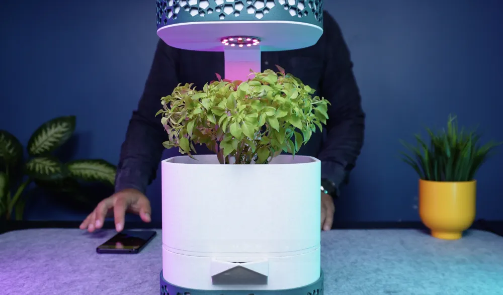
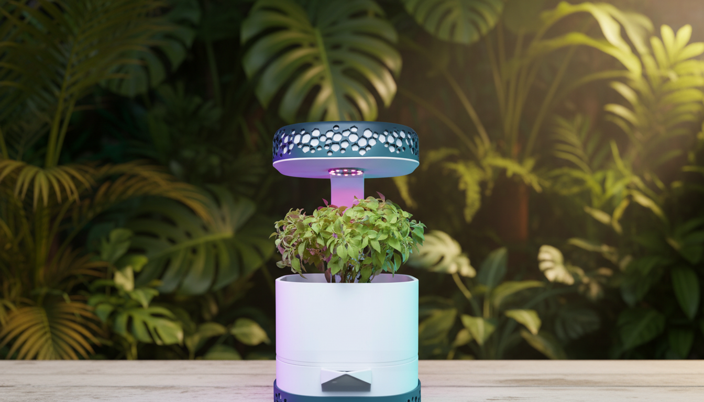
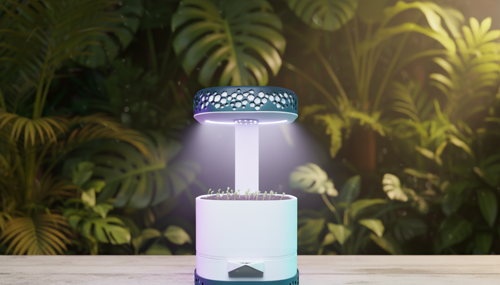

# Smart Garden AIoT

Smart Garden AIoT is a hybrid platform that combines three domains in one system:

- An IoT dashboard for real-time monitoring and device control
- AI services for plant disease detection and care recommendations
- An e-commerce flow for smart gardening products

The project uses Next.js App Router, MongoDB Atlas, HiveMQ Cloud MQTT, FastAPI (YOLOv8), and LLM chat providers (Groq/OpenRouter/Ollama).

## Team Members

- Ho Du Tuan Dat - 2374802010097
- Duong Ngoc Linh Dan - 2374802010091
- Duong Chi Thien - 2374802010468
- Nguyen Minh Chinh - 2275106050051

## Website Visual Gallery

### Hero and Landing Visuals





### Product Showcase


## Core Features

- Device dashboard: device list, online/offline status, sensor trends, and alerts
- Sensor control: light/pump commands and threshold configuration
- AI Lab: image capture/upload, YOLOv8 diagnosis, and diagnostic history
- Plant Doctor AI: chatbot for hydroponic care with sensor-aware context
- E-commerce: products, cart, checkout, and order flow
- Admin area: users, products, orders, and diagnostics management

## System Architecture

- Frontend: Next.js 16 + TypeScript + Tailwind CSS
- Backend API: App Router Route Handlers
- Database: MongoDB Atlas (Mongoose)
- IoT messaging: HiveMQ Cloud MQTT (TLS)
- AI services:
	- PlantAI FastAPI (YOLOv8)
	- Chat providers: Groq, OpenRouter, Ollama (local)
- Image storage: Cloudinary

## Data Flow Overview

1. ESP32 sends sensor readings via MQTT (or HTTP fallback through /api/ingest).
2. Backend stores readings in MongoDB, updates device state, and creates alerts when thresholds are exceeded.
3. Image capture pipeline: snapshot -> AI predict -> sensor fusion -> diagnostic storage.
4. Dashboard and AI Lab fetch and render near real-time data (smart polling).

## Main Project Structure

- app: pages and API routes
- components: UI components for dashboard, marketing, and admin
- lib: auth, MongoDB, MQTT, and helper utilities
- models: Mongoose schemas
- plant_ai_service: FastAPI service and YOLO model runtime
- public: images and videos
- docs: design, database, roadmap, and ESP32 integration documents

## Local Setup

### 1. Install dependencies

```bash
npm install
```

### 2. Create environment file

Create .env.local with at least these variables:

```env
NEXTAUTH_URL=
NEXTAUTH_SECRET=

GOOGLE_CLIENT_ID=
GOOGLE_CLIENT_SECRET=

MONGODB_URI=
MONGODB_DB_NAME=AIoT

MQTT_HOST=
MQTT_PORT=8883
MQTT_USERNAME=
MQTT_PASSWORD=

CLOUDINARY_CLOUD_NAME=
CLOUDINARY_API_KEY=
CLOUDINARY_API_SECRET=

PLANT_AI_SERVICE_URL=http://localhost:8000
```

### 3. Run the web app

```bash
npm run dev
```

### 4. Run PlantAI service

```bash
uvicorn plant_ai_service.main:app --host 0.0.0.0 --port 8000
```

### 5. Run Ollama (optional)

```bash
ollama serve
```

## Key API Endpoints

- GET/POST /api/devices
- POST /api/ingest
- POST /api/ai/predict
- POST /api/ai/chat
- GET/POST /api/devices/[deviceId]/diagnostics
- GET/PATCH /api/devices/[deviceId]/alerts

## Project Status

Completed:

- Authentication and role-based middleware
- Core dashboard and AI Lab
- AI prediction pipeline with diagnostic persistence
- Product listing/cart/basic checkout flow
- Admin page structure

In progress:

- Real-time push notifications
- Payment integration
- Full admin CRUD completion
- Firmware optimization and production hardening

## Documentation

- [Project overview](docs/project_documentation.md)
- [Roadmap and phases](docs/PROJECT_PHASES.md)
- [System logic](docs/SYSTEM_LOGIC.md)
- [Database design](docs/DATABASE_DESIGN.md)
- [ESP32 integration](docs/ESP32_INTEGRATION.md)
- [Native AI setup](docs/NATIVE_AI_SETUP.md)
- [UI/UX report](docs/UI_UX_REPORT_SMART_GARDEN_AIOT.md)
