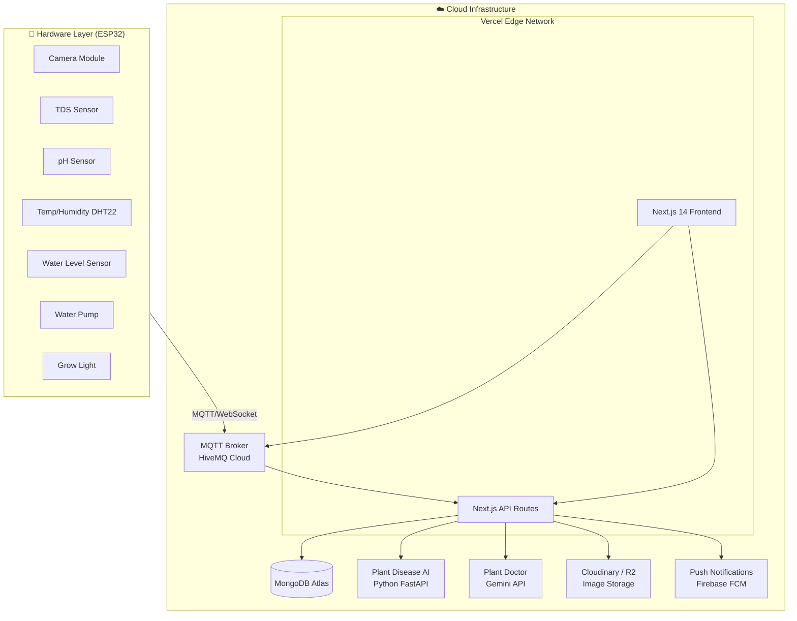

# Project Documentation

This document contains overall project information, architectural design, and file structure details.

---

## 1. Project Overview & Architecture
*(Source: smart_garden_aiot_design.md)*

> **Version:** 1.0 | **Ngày:** 19/03/2026 | **Stack:** Next.js 14 · Vercel · MongoDB Atlas · ESP32

### 📋 Tổng Quan Dự Án
**Smart Garden AIoT** là nền tảng thương mại điện tử kết hợp hệ thống IoT thông minh cho cây trồng thủy canh. Khách hàng có thể mua sản phẩm (hạt giống, dinh dưỡng, chậu thông minh) và quản lý chậu cây qua dashboard được tích hợp AI nhận diện bệnh lá và chatbot tư vấn cây trồng.

### 🏗️ Kiến Trúc Hệ Thống Tổng Thể

### 🗄️ Lựa Chọn Database: MongoDB Atlas ✅
(See original file for comparison table)
> **Kết luận:** Chọn MongoDB Atlas vì dữ liệu sensor IoT có dạng document/JSON tự nhiên.

### 🗺️ Cấu Trúc Website (Sitemap)
- **Home:** Landing page, Feature Strip, Product Showcase.
- **Products:** Category pages, Product details.
- **Cart/Checkout:** Shopping functionality.
- **Auth:** Google OAuth.
- **Dashboard:** Overview, Sensor Control, AI Lab, Plant Doctor, Settings.

### 📄 Chi Tiết Từng Trang & Dashboard
(Chi tiết các màn hình Dashboard và chức năng từng tab)
- **Tab 1: Overview:** Metrics realtime, Live camera.
- **Tab 2: Sensor Control:** Điều khiển bơm, đèn, calibration.
- **Tab 3: AI Lab:** Lịch sử phân tích bệnh cây.
- **Tab 4: Plant Doctor:** Chatbot tư vấn.
- **Tab 5: Settings:** Cấu hình thiết bị.

### 🤖 Kiến Trúc AI/ML & Phần Cứng
- **AI Vision:** YOLOv8 / Gemini Vision API để nhận diện bệnh.
- **Plant Doctor:** Chatbot dùng Gemini.
- **Sensor Fusion:** Rule engine kết hợp dữ liệu nhiều cảm biến.
- **Hardware:** ESP32, Camera OV2640, Sensors (TDS, pH, DHT22...).

### 🏛️ Cấu Trúc Database (MongoDB Atlas)
Collections: `users`, `devices`, `sensor_readings` (Time Series), `ai_diagnostics`, `products`, `orders`, `chat_history`.

### 🎨 Design System
- **Colors:** Emerald (Primary), Blue (Info), Orange (Action), Status colors.
- **Typography:** Inter font.

### 🚀 Kế Hoạch Triển Khai (Phases)
- **Phase 1:** MVP (Migration, Basic E-commerce, Dashboard UI).
- **Phase 2:** IoT Integration.
- **Phase 3:** AI Features.
- **Phase 4:** Full E-commerce.

---

## 2. File Information & Structure
*(Source: project_file_information.md)*

### Thong tin hien tai cua du an
Tai lieu tong hop cac thanh phan hien co va vai tro cua tung file trong du an.

### Pham vi quet
- Bao gom toan bo file trong thu muc AIoT_SmartGarden/.
- Loai tru thu muc sinh tu dong/phu thuoc.

### Tong quan
- **web/:** ung dung Next.js App Router, gom giao dien va API route.
- **Cac file .md o thu muc goc:** tai lieu thiet ke, test, todo, ghi chu.

### List of Files (Selected)
- **Config:** `.gitignore`, `.env.local`, `next.config.ts`, `tailwind.config.ts`, `tsconfig.json`.
- **Docs:** `AGENTS.md`, `CLAUDE.md`, `README.md`.
- **Pages (App Router):**
    - `app/page.tsx` (Home)
    - `app/dashboard/...` (Dashboard routes)
    - `app/products/...` (E-commerce routes)
    - `app/api/...` (Backend API endpoints)
- **Components:** `components/dashboard`, `components/marketing`.
- **Lib:** `lib/mongodb.ts`, `lib/auth.ts`, `lib/mqtt.ts`.
- **Models:** Mongoose models in `models/`.

(See detailed file list in original `project_file_information.md` if needed for detailed audit).
